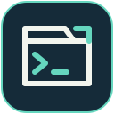

# Terminal Workspace

**Your servers, shells, and tunnels in one keyboard workflow.**

Give Windows Terminal a searchable SSH picker, saved port forwards, and shortcuts
that bring you back to the right machine. Run a coding agent on a server, preview
its app on localhost, and keep the shell and tunnels within reach across tabs
and windows.

[](https://github.com/brant92good/terminal-workspace/actions/workflows/test.yml)
[](docs/platforms.md)
[](LICENSE)

[Install](#install) · [Daily use](docs/daily-use.md) · [Standalone apps](#use-only-what-you-need) · [Setup help](docs/setup.md)


*The included SSH Sessions picker, using example machines.*

> Version 0.7.2 bundles the SSH session screen-cleanup fix. Installation and
> captured-command checks pass; taskbar grouping remains beta.
> [Verification](docs/verification.md).

## Install

On **Windows 10/11 x64**, with Windows Terminal, PowerShell 7 and OpenSSH Client:

```powershell
powershell -NoProfile -ExecutionPolicy Bypass -Command "irm https://raw.githubusercontent.com/brant92good/terminal-workspace/v0.7.2/bootstrap.ps1 | iex"
```

Setup downloads compiled apps and checks their SHA256 hashes. It needs no Python,
Rust toolchain or Git. No server address is required during installation.

Open **Terminal Workspace** from Start. Add a machine or import an SSH alias,
then choose it. The remote tab opens first and **Ports** second, with the remote
tab selected. Ordinary new tabs open the SSH picker; **Ctrl+Alt+N** opens local
PowerShell. Appearance and menus stay as configured.

[Prerequisites, options and updates](docs/setup.md) ·
[What setup changes](docs/setup.md#what-changes)

## Keep the loop short

| You want to… | Do this |
| --- | --- |
| Open a server in a new tab | Use **+** or **Ctrl+Shift+T**, then search or choose a numbered favorite |
| Return to this machine's shell | **Ctrl+Alt+R** |
| Return to this machine's saved tunnels | **Ctrl+Alt+P** |
| Open another view | Add **Shift** to the R/P shortcut |
| Work locally | **Ctrl+Alt+N**, or the picker's Local terminal row |
| Keep return shortcuts inside the current window | **F2** in Ports |

The shortcuts apply while Windows Terminal has focus. With several windows open,
the invoking window's machine context determines the target; the most recently
used matching view wins. The current-window setting keeps that search local.


*Ports with example servers and simulated connection states.*

For a dev server on remote port **8000**, type `8000` in Ports and press **Enter**.
When it shows **ON**, press **B** to open `http://localhost:8000`. Several servers
can forward at once. A background controller keeps active forwards independent
of the views and retries recoverable network failures. Stop forwards explicitly
when finished; reboot and sign-out end the connections.

Prefer **Ctrl+N** for a new tab? Set it once with
`./install.ps1 -SkipDependencies -NewTabShortcut ctrl+n` in the installed directory.
[Keyboard and machine-selection details](docs/daily-use.md).

## Use only what you need

- **[SSH Sessions](https://github.com/brant92good/ssh-session-tui)** — searchable
  machines, numbered favorites, groups, SSH import and routes chosen per device.
- **[Ports](https://github.com/brant92good/port-forward-tui)** — saved SSH forwards,
  several servers in one list, background connections and reconnect.
- **Terminal Workspace** — the Windows profiles, paired tabs, return shortcuts and
  optional local/remote [Herdr](https://herdr.dev/) integration around those apps.

Both leaves have their own compiled installers for Windows, Linux and macOS
(macOS **beta**). This repo's Terminal integration is **Windows only**.
[Platform boundaries](docs/platforms.md).

The picker and paired workspace currently have separate machine catalogs.
Selecting a picker machine does not retarget an existing shell/Ports pair.

## Who might find this useful?

Developers who work on remote machines, run agents away from their laptop, or
regularly open remote web apps and notebooks locally. It is also useful when
your shell is already familiar and you want better navigation around it.

A fork can share Terminal appearance and shortcut preferences. An optional
private parent can hold your machine catalog and other personal setup. Public
installs work independently; released bundles pin exact app versions and hashes.
[Settings and repository layers](docs/daily-use.md#use-the-same-settings-on-another-computer).

## Evidence and limits

The compiled release passes native settings and launch checks, actual-ZIP
install/update tests, and the public HTTPS bootstrap on PowerShell 5.1 and 7.
Wrapper JSON pipelines and interactive input are tested through real pseudo
terminals. [Verification and remaining gates](docs/verification.md).
Historical focus/SSH/persistence checks and [timing measurements](docs/before-after.md)
remain available with their versions and conditions; they are not a new Rust
performance claim.

Separate taskbar grouping is **beta**. Explorer's optional **Open PowerShell here**
entry opens the clicked directory locally without changing new tabs; on Windows
11 it appears under **Show more options**. [Taskbar and Explorer details](docs/setup.md#explorer-and-taskbar).

For a script or coding agent, run `./doctor.ps1 --json`,
`./ports.ps1 list --json` or `./sessions.ps1 list --json` from the installation.

[Contributing](AGENTS.md) · [Alternatives](docs/alternatives.md) · [MIT](LICENSE) · [Artwork attribution](NOTICE)
