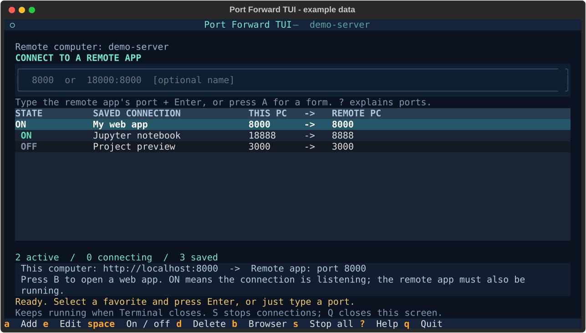
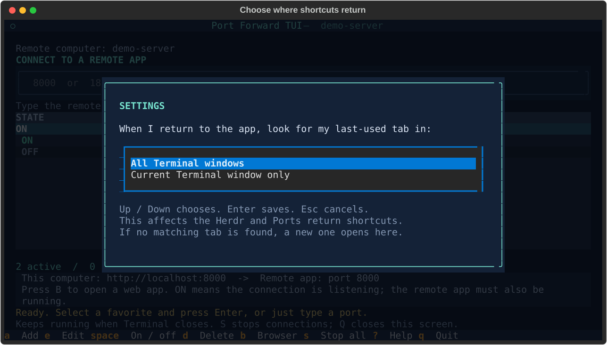

# Terminal Workspace

**One button opens your remote terminal and your saved app connections. Bring either one back with a keyboard shortcut.**

This Windows setup combines **Herdr**, where you work on a remote computer,
with **Ports**, where you make its web apps and notebooks available in your
local browser. It also makes PowerShell 7 the default shell and keeps your WSL
Linux profiles easy to find.

```text
Open Terminal Workspace
       |
       +-- Tab 1: Herdr  <- selected, ready for remote work
       +-- Tab 2: Ports <- saved connections to remote apps
```



*Actual Ports interface with simulated example data. Herdr runs in the other tab.*

## Choose the right project

| What you need | Repository |
| --- | --- |
| Only saved port connections | [Port Forward TUI](https://github.com/brant92good/port-forward-tui) — smaller, independent install |
| Herdr, Ports, shortcuts and shared Terminal appearance | **This repository** |
| Your private SSH values, agent skills and a repeatable personal laptop setup | An optional private repository that includes this one |

You do not need access to the author's private repository. This public project
works on its own. It includes the port app as a **submodule**: a separate Git
repository held at a specific version. The download command below fetches both.

## Set up on Windows

Use a **PowerShell tab on Windows 10/11**. You need:

| Tool / information | Purpose and where to get it |
| --- | --- |
| Windows Terminal | The window that holds the tabs; available in Microsoft Store |
| PowerShell 7 | The default command shell; install with `winget install --id Microsoft.PowerShell -e` |
| Git for Windows | Downloads this project and its included port app; [download](https://git-scm.com/downloads/win) |
| Windows Python 3.12+ | Runs Ports; [download](https://www.python.org/downloads/windows/) or select an existing Conda Python |
| Windows OpenSSH Client | Connects to your remote computer; install through Windows Optional features |
| Herdr | The remote-terminal app; follow [Herdr's installation guide](https://herdr.dev/) |
| Your working SSH name | If you connect using `ssh workbox`, your name is `workbox` |

Before installing, run `ssh YOUR_SSH_NAME`, confirm you can log in, and type
`exit`. If this is new to you, the port app's [first-connection walkthrough](https://github.com/brant92good/port-forward-tui#set-up)
explains ports, SSH names and keys. Saved background connections need a working
SSH key or key agent because they cannot ask for a password.

```powershell
git clone --recurse-submodules https://github.com/brant92good/terminal-workspace.git
cd terminal-workspace
.\doctor.ps1
.\install.ps1 -SshHost workbox
.\open.ps1
```

Replace `workbox` with your SSH name. On the first doctor run, missing local
environment/launcher checks are expected: installation creates them. You can
omit `-SshHost` to answer a question; later runs reuse the saved name.

**What setup changes:** it creates a private Python environment, backs up
Terminal settings, adds Herdr/Ports profiles and shortcuts, sets PowerShell 7 as
default, and creates a **Terminal Workspace** button in Start and on the desktop.
The default compact menu hides other profiles while keeping PowerShell, WSL,
Herdr and Ports. Hidden profiles are not deleted. To retain your full menu,
set `compactMenu` to `false` in `config/terminal.json` before installing.

Keep the checkout where you installed it; shortcuts refer to that folder.
For custom installations, pass `-Python 'C:\path\python.exe'` or
`-HerdrPath 'C:\path\herdr.exe'`. Conda is not activated on each shortcut press.
If script execution is blocked, inspect the script and, where allowed, run it
through `powershell.exe -NoProfile -ExecutionPolicy Bypass -File .\install.ps1 -SshHost workbox`.

## Use it every day

Open **Terminal Workspace** from Start, the desktop, or `.\open.ps1`.
Right-click its Start entry and choose **Pin to taskbar** for a taskbar button.

In Herdr, work on your remote computer. In Ports, press **A** to add a connection
or type the remote app's port, such as `8000`, then Enter. Press **B** on an ON
row to open its HTTP address here. The remote app must already be running.

These shortcuts work **while Windows Terminal has focus**:

| Key | Result |
| --- | --- |
| Ctrl+Alt+H | Return to the Herdr tab you used most recently; open one if needed |
| Ctrl+Alt+P | Return to the Ports tab you used most recently; open one if needed |
| Add Shift to either shortcut | Open another connected tab |
| F2 inside Ports | Choose whether return shortcuts search this window or all Terminal windows |



*Actual settings screen. Both Herdr and Ports use this preference.*

Multiple Ports tabs share their favorites and connection state. Closing every
Terminal window leaves the background SSH forwards running; **S** in Ports stops
them. Reboot, sign-out or network loss ends tunnels. Herdr keeps its workspace
on the remote server; use its detach command when leaving a client.

The return shortcut briefly opens a launcher tab. It selects the most recently
used matching tab within your chosen window scope. A tab may appear briefly
during that handoff. Moving Herdr tabs between windows may require reopening
the view; separate split panes are not tracked as separate tabs.

## Check setup or ask an agent for help

```powershell
.\doctor.ps1                 # Human-readable local checks and next steps
.\doctor.ps1 --json          # The same checks for an agent
.\ports.ps1 list --json      # Favorites and available live connection state
.\ports.ps1 save --remote 8000 --name 'My web app' --json
```

`doctor` does not install, write settings or contact SSH. You need a usable
Windows Python to run it. If included files are missing, run
`git submodule update --init --recursive` from this folder first.
An unreadable `.machine.json` should be backed up and repaired rather than deleted.
If a shortcut opens a new tab unexpectedly, check F2's scope and whether the old
Herdr tab was moved or reopened.

For agents, read [AGENTS.md](AGENTS.md). Setup accepts `-NonInteractive` to avoid
host questions and Git credential prompts; missing information is an error.
The connection command's [examples and JSON contract](https://github.com/brant92good/port-forward-tui#use-it-with-a-coding-agent-or-script)
apply unchanged from this folder. Agents should use exact favorite IDs, not
guess row numbers or directly overwrite a live favorites file.

## Share settings between computers

`config/terminal.json` stores shared appearance and shortcuts. Your SSH name and
resolved app paths stay in ignored `.machine.json` on each computer. A submodule
pin stores the version of the port app; each install uses that recorded version.

```powershell
.\sync.ps1             # Download shared preferences and apply them here
.\sync.ps1 -Publish    # Save and push this computer's portable preferences
```

Use `-Publish` only in a repository you can write to, such as your own fork.
It exports appearance and managed shortcuts, not shell commands, SSH targets or
machine paths. Existing local Git changes must be saved before downloading a
new version. Keep personal values in your own private parent if desired.

The [technical reference](REFERENCE.md) covers settings details and desktop
verification. The [latency report](docs/before-after.md) shows measured results,
possible improvements and environment differences; it is not a speed guarantee
for every Windows machine.

[MIT license](LICENSE). Herdr artwork attribution: [NOTICE](NOTICE).
